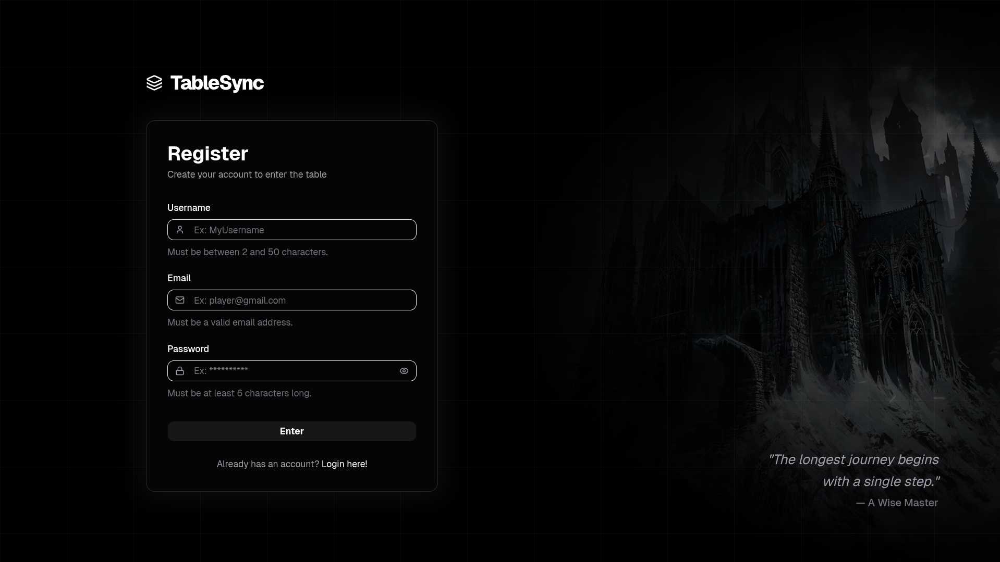

<div align="center">

# TableSync

**Real-time collaborative RPG tabletop platform**

[](https://openjdk.org/)
[](https://spring.io/projects/spring-boot)
[](https://react.dev/)
[](https://www.typescriptlang.org/)
[](https://www.postgresql.org/)
[](https://tailwindcss.com/)
[](https://docs.docker.com/compose/)

[Demo](#-demo) • [Features](#-features) • [Stack](#-tech-stack) • [Architecture](#-architecture) • [Getting Started](#-getting-started) • [API Docs](#-api-documentation) • [How To Play](#-how-to-play)

</div>

## Demo

### Tabletop — During a session


### Character Creation


### Dashboard


### Register Page



## Features

### For Players
- Create and customize a character with a photo, name, and a fully dynamic attribute sheet
- Move your character token on the shared tabletop in real time
- Roll dice directly in chat using `/roll NdN+N` notation
- Edit your character sheet at any time

### For Game Masters
- Create password-protected sessions
- Define a custom character sheet template with any fields (HP, Mana, Strength, etc.)
- Create any existing RPG sheet, including original sheets
- Import templates from previous sessions with one click
- Place NPC and enemy tokens on the canvas with custom names, images, and sizes
- Drag NPC tokens around the map. Movements sync to all players instantly
- Update the background image and its scale in real time
- Edit the template mid-session. Changes propagate instantly to all players

### Real-time Multiplayer
- WebSocket-powered communication via STOMP protocol
- All map state changes (tokens, background, NPCs) sync instantly across all connected clients
- New players appear on the tabletop the moment they create their character
- Persistent state: sessions, positions, backgrounds, and NPC tokens survive page refreshes

### Security
- JWT authentication
- Rate limiting on `/auth/login` and `/auth/register`
- All session endpoints require participation. You cannot access a session you haven't joined
- Password-protected sessions (bcrypt hashed)

## Tech Stack

### Backend
| Technology | Version | Purpose |
|---|---|---|
| Java | 21 | Language |
| Spring Boot | 4.0.2 | Framework |
| PostgreSQL | 16 | Database |
| Bucket4j | 8.10.1 | Rate limiting |
| OpenAPI | — | API documentation |

### Frontend
| Technology | Version | Purpose |
|---|---|---|
| React | 19 | UI framework |
| TypeScript | 5 | Type safety |
| Tailwind CSS | 4 | Styling |
| Konva | — | Canvas / interactive tabletop |
| Lucide React | — | Icons |

### Infrastructure
| Technology | Purpose |
|---|---|
| Docker + Docker Compose | Local development & containerization |

## Architecture

```
tablesync/
├── src/                              # Spring Boot backend
│   └── main/java/com/tablesync/
│       ├── config/                   # Security, CORS, WebSocket, JWT filter, Rate limit
│       ├── controller/               # REST + WebSocket controllers
│       ├── dto/                      # Request/Response DTOs
│       ├── entity/                   # JPA entities
│       ├── enums/                    # Enums (SessionStatus, MessageType, etc.)
│       ├── exception/                # Global exception handler
│       ├── repository/               # Spring Data JPA repositories
│       └── service/                  # Business logic
│
├── frontend/                         # React + TypeScript
│   └── src/
│       ├── components/
│       │   ├── Tabletop.tsx          # Canvas with Konva (player tokens, NPC tokens, background)
│       │   ├── PrivateRoute.tsx
│       │   └── PublicRoute.tsx
│       ├── pages/
│       │   ├── dashboard.tsx         # Session management
│       │   ├── SessionEdit.tsx       # Template creation
│       │   ├── SessionCreate.tsx     # Character creation
│       │   ├── SessionPlay.tsx       # Main play screen
│       │   ├── session.tsx           # Routing middleware
│       │   ├── login.tsx
│       │   └── register.tsx
│       └── services/
│           └── api.ts                # Axios instance with JWT interceptor
│
├── docker-compose.yml
└── Dockerfile
```

### Real-time event types (WebSocket topics)

| Event type | Direction | Description |
|---|---|---|
| `TOKEN_MOVE` | Any player → All | Player character dragged |
| `BACKGROUND_UPDATE` | Master → All | Background image or scale changed |
| `CHARACTER_JOINED` | Server → All | New character created, refresh tokens |
| `CHARACTER_IMAGE_UPDATED` | Player → All | Player avatar changed |
| `NPC_TOKEN_ADD` | Master → All | NPC/enemy token placed |
| `NPC_TOKEN_REMOVE` | Master → All | NPC/enemy token removed |
| `NPC_TOKEN_MOVE` | Master → All | NPC/enemy token dragged |
| `NPC_TOKEN_SCALE` | Master → All | NPC token resized |
| `TEMPLATE_UPDATED` | Master → All | Sheet template edited mid-session |

## Getting Started

### Prerequisites

- **Java 21+**
- **Maven 3.9+**
- **Node.js 20+**
- **Docker & Docker Compose**

### 1. Clone the repository

```bash
git clone https://github.com/ArthurDOli/TableSync.git
cd TableSync
```

### 2. Start the database

```bash
docker compose up -d postgres
```

This starts PostgreSQL on port `5433` (mapped to container port `5432`).

### 3. Configure the backend

Create or edit `src/main/resources/config/application-local.yml`:

```yaml
spring:
  datasource:
    url: jdbc:postgresql://localhost:5433/tablesync
    username: postgres
    password: postgres

jwt:
  secret: your_256bit_hex_secret_here
  expiration: 86400000
```

> **Generate a JWT secret:** `openssl rand -hex 32`

### 4. Run the backend

```bash
./mvnw spring-boot:run -Dspring-boot.run.profiles=local
```

The API will be available at `http://localhost:8080`.  
Swagger UI: `http://localhost:8080/swagger-ui.html`

### 5. Run the frontend

```bash
cd frontend
npm install
npm run dev
```

The app will be available at `http://localhost:5173`.

### 6. (Optional) Run everything with Docker

```bash
docker compose up --build
```

> Set `JWT_SECRET` as an environment variable before running.

## API Documentation

With the backend running, access the interactive Swagger UI at:

```
http://localhost:8080/swagger-ui.html
```

### Main endpoints

| Method | Endpoint | Auth | Description |
|---|---|---|---|
| `POST` | `/api/v1/auth/register` | ❌ | Register a new user |
| `POST` | `/api/v1/auth/login` | ❌ | Login and receive JWT |
| `GET` | `/api/v1/sessions/my-sessions` | ✅ | List sessions the user participates in |
| `POST` | `/api/v1/sessions` | ✅ | Create a new session |
| `POST` | `/api/v1/sessions/join` | ✅ | Join an existing session |
| `GET` | `/api/v1/sessions/:id` | ✅ | Get session details |
| `PATCH` | `/api/v1/sessions/:id/background` | ✅ Master | Update background image |
| `PATCH` | `/api/v1/sessions/:id/npc-tokens` | ✅ Master | Update NPC tokens |
| `POST` | `/api/v1/templates` | ✅ Master | Create character template |
| `PUT` | `/api/v1/templates/:id` | ✅ Master | Update template |
| `POST` | `/api/v1/characters` | ✅ | Create a character |
| `PATCH` | `/api/v1/characters/:id` | ✅ | Update character (sheet, position, image) |
| `GET` | `/api/v1/characters/session/:id` | ✅ | List all characters in a session |
| `GET` | `/api/v1/chat/history/:sessionId` | ✅ | Fetch chat history |

## How to play

### Creating a session (Game Master)

1. Register or log in
2. On the Dashboard, fill in the session name, description, and a password
3. Click Create — the session appears in "My Sessions"
4. Click on your session and you'll be redirected to the Master Panel
5. Add a template name and define the attribute fields (e.g. HP, Mana, Strength)
6. Click Save Template & Open Tabletop

### Joining a session (Player)

1. Ask the Game Master for the session ID and password
2. On the Dashboard, enter the ID and password in "Enter Session"
3. Click Enter and the session appears in "My Sessions"
4. Click on the session and you'll be redirected to Forge your Hero
5. Fill in your character name, optionally add an avatar, and fill in the attribute fields
6. Click Join Tabletop

### During the session

- **Move your token:** drag it across the canvas
- **Roll dice:** type `/roll 2d20` (or any `NdN+N` formula) in the chat
- **Update your sheet:** edit the fields in the left panel and click Save
- **Update your avatar:** hover over your avatar in the left panel and click the camera icon

## Contributing

Contributions are welcome! Please open an issue first to discuss any major changes.

## License

This project is licensed under the [MIT License](./LICENSE).